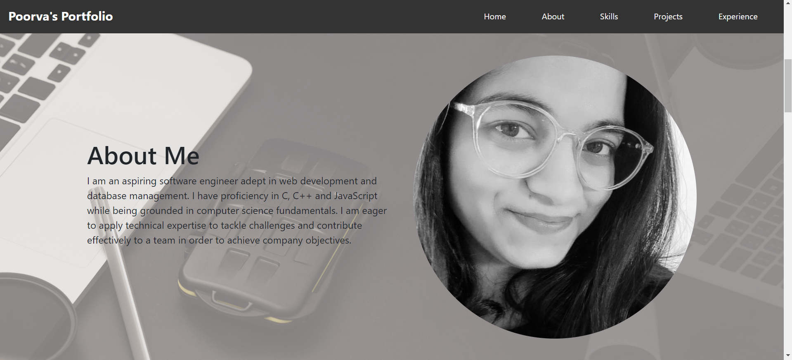

# Poorva-s-Portfolio

## Description
This repository contains the source code for my personal portfolio website. This is a responsive, static portfolio website featuring projects and detailed skill sections, and experience in the industry achieving 100% mobile compatibility.

## Demo

## Technologies Used
- HTML
- CSS
- JavaScript

## Features
- Responsive design
- Project showcase with detailed descriptions
- Skills section
- Contact form

## Contact Me
- email:- poorvabhagwat@gmail.com
- linkedin:- https://www.linkedin.com/in/poorva-bhagwat/

## Installation
Clone the repository:
git clone https://github.com/Poorvab2525/Poorva-s-Portfolio.git

Open the folder in your local machine

